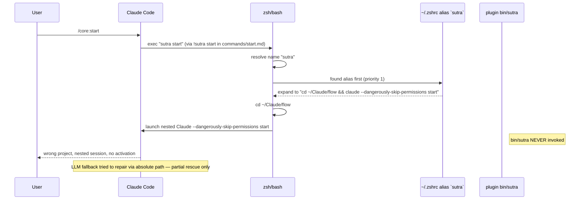

# `sutra` CLI Name Collision — Design Doc

**Date:** 2026-04-22
**Author:** CEO of Asawa (sub-region D of dogfood fan-out)
**Status:** Design proposal — not implemented
**Severity:** P0 (marketplace promo blocker)
**Source:** Finding #12 from 2026-04-22 live Sutra plugin dogfood
**Scope:** Design decision only. No code changes, no docs changes, no commits from this doc.

---

## 1. Problem statement

On 2026-04-22, during a live dogfood of the Sutra plugin (`core@sutra` v1.7.0), the founder's pristine-looking activation path broke in a way that is invisible on clean machines and catastrophic on real ones. The machine had a pre-existing shell alias in `~/.zshrc`:

```bash
alias sutra='cd ~/Claude/flow && claude --dangerously-skip-permissions'
```

When Claude Code executed the plugin's activation sequence — which internally shells out to `!sutra start` (see `/Users/abhishekasawa/Claude/asawa-holding/sutra/marketplace/plugin/commands/start.md:11`) — the shell resolved `sutra` through its normal name-lookup order. In zsh that order is: aliases > functions > builtins > hash table > `$PATH`. The plugin's `bin/sutra` binary lives on PATH (Claude Code auto-adds every installed plugin's `bin/` directory), so it *should* have been reachable. But the alias won the lookup race before PATH was ever consulted. The shell expanded `sutra start` into `cd ~/Claude/flow && claude --dangerously-skip-permissions start` — which cd'd into the PPR project directory, launched a nested Claude Code session, and passed `start` as a positional argument that Claude Code itself then tried to auto-route. The plugin's actual `bin/sutra` script at `/Users/abhishekasawa/Claude/asawa-holding/sutra/marketplace/plugin/bin/sutra` was never invoked. No telemetry. No identity file. No depth marker. The session that *should* have been "activate Sutra in the current project" became "open a new Claude session in a different project."

What shielded the founder from total failure was Claude Code's own fallback: the inner Claude Code LLM saw the unroutable invocation, inferred intent, and auto-routed to the plugin's real binary via its absolute path — effectively re-invoking the correct script by reading the plugin manifest. Without that LLM-layer rescue (which is neither contractual nor reliable), the activation would have returned a confusing error or silently opened the wrong project. Any "dumber" harness — a CI runner, a scripted installer, a non-Claude-Code caller — would have failed opaquely.

This is load-bearing because it affects every install surface that resolves `sutra` through the shell. The plugin's documented happy path (`claude plugin install core@sutra` → `/core:start` inside Claude Code) is actually two different paths depending on how Claude Code dispatches the `!sutra` shell-out. On macOS terminal and macOS desktop (the two surfaces we ship to first), it goes through the user's shell environment. Which means it inherits every alias, function, and PATH-earlier binary the user has already accumulated. Our dogfood VMs were clean. Our real users are not.

---

## 2. Root cause

Claude Code's plugin loader prepends `$CLAUDE_PLUGIN_ROOT/bin` to PATH on session start. When a slash command like `/core:start` runs `!sutra start`, Claude Code invokes the user's login shell (zsh/bash) with that command string. Shell name resolution walks aliases → functions → builtins → hashed commands → PATH. The plugin's `bin/sutra` only wins if no higher-priority binding exists. Any user-defined alias or function named `sutra` wins first. The plugin binary is strictly a tie-breaker for users with no prior binding — which is exactly the `$HOME`-clean VM case our dogfood tested.



The race is deterministic, not flaky. Any shell user with `alias sutra=...` or a function `sutra() { ... }` in their rc file hits it every time. The probability is not 0% and not 100% — it's "the intersection of our target audience with the word `sutra` in their rc files." Our target audience is Claude Code power users who curate aliases. That intersection is non-trivial.

---

## 3. Blast radius

| User population | Collision likelihood | Evidence |
|---|---|---|
| Clean-install VM / fresh macOS | 0% | Our dogfood harness. No rc customization. |
| Power users with `alias sutra=...` | 100% | Founder's own machine (2026-04-22). Anyone who has a multi-project shortcut named `sutra` — a common 5-char project shorthand. |
| Users with a shell function `sutra()` | 100% | Tmux/starship/custom workflow users who wrap common commands. Not rare. |
| Users with a different `/usr/local/bin/sutra` binary | 100% | Unlikely but possible. Third-party yoga/meditation CLI, internal tools at some orgs, a Nix pkg conflict. |
| Users with `sutra` in a `.envrc`, `.tool-versions`, or direnv | 100% | Rare but silent — PATH shimming wins similarly. |

**Why this matters for GTM:** the marketplace promo audience *is* the power-user population. The users most likely to install a plugin called `core@sutra` from the Claude Code marketplace are the same users most likely to have already attached meaning to the word `sutra` in their environment. Clean-install metrics under-represent the failure rate. Our dogfood passed precisely because it doesn't match the target population.

**Not affected:**
- Users who invoke only via slash commands (`/core:start`, `/core:status`) AND whose slash-command implementations don't shell out through the name `sutra`. BUT — see `commands/start.md:11`, `commands/status.md:9`, `commands/update.md:9`, `commands/permissions.md:9`, `commands/uninstall.md:10` — every one of these *does* shell out via `!sutra <sub>`. So "slash command only" users are equally affected. The prefix `/core:` protects the slash-command name but not the subshell invocation.
- Windows native (not WSL2). Hooks no-op per README table, so collision is moot — but they can't fully use the plugin either.

---

## 4. Options

Four directions have been enumerated. The table below is the decision surface. Each option's downstream-dep list is in §7.

| Option | Design | Pros | Cons | Effort | Break risk for v1.x users |
|---|---|---|---|---|---|
| **A: Rename binary to `sutra-core`** | `bin/sutra` → `bin/sutra-core`. Update every README, every `!sutra` shell-out in `commands/*.md`, every shell helper (`sutra-go` → `sutra-core-go` or keep `sutra-go` as helper-only), and the install-shell-helpers preamble. Marketplace identifier stays `core@sutra`. | Zero collision risk in practice — `sutra-core` is hyphenated, non-dictionary, unlikely to pre-exist in any user's rc. Semantically honest: it matches the `core@sutra` plugin identifier the user already sees in `claude plugin install`. Retains the "sutra" family root for brand. | Every existing v1.x user relearns the command. v1.5+ shell helpers (`sutra-go`, `sutra-uninstall`, `sutra-reset`, `sutra-status-global`) need a rename decision — keep them (orthogonal namespace) or rename to match. Breaking change to slash-command internals (`!sutra <sub>` becomes `!sutra-core <sub>`). | Medium (1 day — plugin binary rename, 6 slash commands, 2 scripts, 2 docs, 1 website section, changelog entry, migration banner) | **High** for terminal-direct users. **Low** for slash-command-only users (they don't see the binary name). |
| **B: Rename binary to `sos`** | `bin/sutra` → `bin/sos`. Short, 3-char. | Shorter than `sutra-core`. Memorable. | Extremely collision-prone — `sos` is a common 3-letter alias (users bind it to "save output", "stash-on-stage", "system ops shortcut"). Semantically disconnected from "sutra" brand; users won't intuit the connection. | Medium | High — breaking *and* likely to collide again. |
| **C: Rename binary to `core`** | `bin/sutra` → `bin/core`. Matches the `/core:*` slash command namespace. | Internally consistent with `/core:start`, `/core:status`, etc. Only one name to learn. | `core` is an extremely common word in shell environments — `core` as alias for `cd ~/core`, `core` as a build tool (Zig's `core`, various proprietary), `core` as a Kubernetes namespace. Collision rate plausibly *higher* than `sutra` itself. Generic words lose brand value. | Medium | High — breaking *and* worse collision profile. |
| **D: Keep `sutra`, add runtime collision detection** | Modify `bin/sutra` to self-check: at first invocation, run `type -a sutra` (or equivalent) in a subshell; if the highest-priority match isn't its own `$BASH_SOURCE`, exit with a human-readable error: "Your shell has another `sutra` command taking priority (alias / function / earlier PATH entry). To use the Sutra plugin: rename your existing `sutra` (e.g., `alias my-sutra=...`) OR invoke the plugin directly via `~/.claude/plugins/cache/sutra/*/bin/sutra`." Also add a `/core:start` pre-flight that runs the same check and surfaces the guidance inside Claude Code. | No breaking change for clean users (0% collision set is unchanged). Informative failure for colliders instead of silent wrong-project. Low-effort to ship. Composable with any future rename — belt-and-suspenders. | Doesn't remove the conflict, only surfaces it. Colliders still have to act — rename their alias or learn the plugin's workaround. In the 2026-04-22 incident, the self-check *would* have fired — but also would have blocked the user on first run, which is worse onboarding than silent-LLM-rescue in the specific case the rescue worked. Adds ~15 lines of startup logic and a platform-specific `type -a` portability concern (sh POSIX vs zsh vs bash). | Low (half a day — one new code path in `bin/sutra`, one check in start.sh, one test, one CHANGELOG line) | **None** for the binary name. **Medium** UX regression for colliders on first run (now a hard error instead of sometimes-works). |

### Codex consult requirement per option

- **Option A:** codex consult required — naming is the load-bearing decision; cross-check "sutra-core" vs alternative hyphenated suffixes (`sutra-cli`, `sutra-os`, `sutra-run`) with Codex's second opinion before committing.
- **Option B:** codex consult required — but this doc already rules it out on collision grounds.
- **Option C:** codex consult required — same reason as B.
- **Option D:** codex consult recommended — ask Codex to stress-test the `type -a` portability and to enumerate shells where the check behaves differently (dash, ash, fish, nushell).

---

## 5. Recommendation

**Recommended: Option A (rename to `sutra-core`) layered with Option D (runtime detection as fallback).**

Rationale, with three anchors:

1. **Brand + identifier alignment.** The marketplace identifier the user types is `core@sutra`. The slash commands are `/core:*`. The plugin internally resolves `claude plugin install core@sutra`. Everywhere the user encounters the plugin's identity, it is the pair `(core, sutra)` — not `sutra` alone. The bare-word `sutra` binary is the *outlier* in our own naming. Renaming to `sutra-core` makes the terminal command consistent with the rest of the surface. The founder's own memory (`project_naming_context_engine.md`, `project_sutra_marketplace.md`) favors precise naming over brand elegance when the two conflict.

2. **Install-path friction is already paid once.** The founder's memory `project_sutra_permissions_in_start.md` commits to "one-command install" — the binary name is hidden inside `install.sh`. Renaming the binary doesn't change what the user types for installation. It only changes what they type for the rare direct-invoke case (`sutra status` from the terminal). The slash-command surface — which is where 90% of interactions happen — is unchanged. The friction is concentrated on power users who invoke directly, and they are the population most equipped to update one alias.

3. **Version vehicle is ready.** Per founder memory `feedback_case_by_case_implementation` — v2 mechanisms ship only when feedback demands. This is that feedback: a live-dogfood breakage on 2026-04-22 against v1.7.0. v1.8.0 is the next planned minor; a binary rename is a minor-version-appropriate breaking change if accompanied by a migration banner and a one-release dual-binary grace period (ship `bin/sutra-core` and a `bin/sutra` shim that forwards with a deprecation notice; remove the shim in v2.0.0).

**Why also layer Option D:** Option A does not help users who *install* v1.8.0 but *already* have `alias sutra=...` and then try `sutra-core` — which might also collide (lower probability but non-zero). Adding the runtime `type -a` self-check in `bin/sutra-core` catches any residual collision on *any* name we pick, now and in the future. It's 15 lines for belt-and-suspenders resilience, and it makes any future rename safer.

**Tradeoff acknowledged:** Option A breaks muscle memory. Shell helpers (`sutra-go`, `sutra-uninstall`, `sutra-reset`) were designed against v1.x naming. Keeping the helpers named `sutra-*` while the core binary is `sutra-core` creates two-name inconsistency. The mitigation is to keep the helpers as-is (they're helper scripts, not the canonical invocation) and document the convention: `sutra-core` is the plugin binary; `sutra-*` are user-installed helper wrappers. This is not pretty, but it's honest and it doesn't double the breakage.

**Why not Option D alone:** "Keep `sutra`, detect + fail loudly" reads as polish but leaves the collision unresolved. Every new Claude Code user with a pre-existing `sutra` alias hits a hard error on their first `/core:start`. That is worse onboarding than "rename your command to `sutra-core`, done." Option D is a safety net, not a primary fix.

---

## 6. Rollback plan

If Option A ships in v1.8.0 and breaks an unexpected surface (a third-party integration pinned to `sutra`; a hook we missed; a docs block still referring to `sutra`), rollback in under 1 hour:

1. Revert the `plugin.json` version bump (`1.8.0` → `1.7.0`).
2. `git revert` the commit(s) that renamed `bin/sutra` → `bin/sutra-core` and the commits that updated `commands/*.md`, `scripts/*.sh`, and website copy.
3. Re-tag the previous git ref as `v1.8.1-rollback` and push.
4. Publish an emergency patch release that keeps `bin/sutra` + adds Option D's runtime collision detector as a standalone fix. This degrades the rollback to Option D only — still P1 on collision resolution, but no regression for v1.7 users.
5. File the failure in `sutra/feedback/` as a post-mortem. Re-plan Option A for v1.9 with whatever surface was missed.

Grace-period safety net: if we ship v1.8.0 with *both* `bin/sutra` (deprecated shim that forwards to `bin/sutra-core` and prints a deprecation banner) and `bin/sutra-core`, rollback risk drops further — v1.7 users' existing `sutra <sub>` invocations keep working for one release cycle. Remove the shim in v2.0.0 per SemVer.

---

## 7. Downstream deps checklist

Per `feedback_downstream_deps` memory — enumerate every surface before executing. Verified against the tree at `/Users/abhishekasawa/Claude/asawa-holding/sutra/` on 2026-04-22.

### Plugin internals (bin, scripts, hooks, commands)

| File | Current reference | Change required (Option A) |
|---|---|---|
| `sutra/marketplace/plugin/bin/sutra` | Binary filename | Rename to `bin/sutra-core`; keep `bin/sutra` as deprecation shim for v1.8.x only. |
| `sutra/marketplace/plugin/bin/sutra` — line 83 (Usage: sutra) | Help text | Update to `Usage: sutra-core <subcommand>`. |
| `sutra/marketplace/plugin/bin/sutra` — line 112-113 (error message) | `sutra: unknown subcommand` | Update to `sutra-core: unknown subcommand`. |
| `sutra/marketplace/plugin/bin/sutra` — line 95 (`sutra-go / sutra-uninstall / ...`) | Help text referencing shell helpers | Keep helper names as-is; update help text to explain binary-vs-helper split. |
| `sutra/marketplace/plugin/commands/start.md` — line 11 | `!sutra start` | `!sutra-core start` |
| `sutra/marketplace/plugin/commands/status.md` — line 9 | `!sutra status` | `!sutra-core status` |
| `sutra/marketplace/plugin/commands/update.md` — line 9 | `!sutra update` | `!sutra-core update` |
| `sutra/marketplace/plugin/commands/update.md` — line 16-17 | Shell fallback block `claude plugin marketplace update sutra && claude plugin update core@sutra` | No change — these are Claude CLI subcommands, not our binary. |
| `sutra/marketplace/plugin/commands/permissions.md` — line 9 | `!sutra permissions` | `!sutra-core permissions` |
| `sutra/marketplace/plugin/commands/permissions.md` — line 19 | Docs prose: "Sutra's own commands (`sutra`, `/core:*`)" | "Sutra's own commands (`sutra-core`, `/core:*`)" |
| `sutra/marketplace/plugin/commands/uninstall.md` — line 10 | `!sutra uninstall $ARGUMENTS` | `!sutra-core uninstall $ARGUMENTS` |
| `sutra/marketplace/plugin/commands/depth-check.md` | Verify for `!sutra ...` patterns | Update if present. |
| `sutra/marketplace/plugin/scripts/start.sh` | `SUTRA_BYPASS` env var name + any self-reference | Keep `SUTRA_BYPASS` (brand env var, unrelated to binary name). Check for internal `exec sutra ...` calls and update. |
| `sutra/marketplace/plugin/scripts/onboard.sh` | Any `sutra <sub>` self-call | Update if present. |
| `sutra/marketplace/plugin/scripts/go.sh` | Any `sutra <sub>` self-call | Update if present. |
| `sutra/marketplace/plugin/scripts/push.sh` | Any `sutra <sub>` self-call | Update if present. |
| `sutra/marketplace/plugin/scripts/status.sh` | Any `sutra <sub>` self-call | Update if present. |
| `sutra/marketplace/plugin/scripts/leak-audit.sh` | Any `sutra <sub>` self-call | Update if present. |
| `sutra/marketplace/plugin/scripts/install-shell-helpers.sh` | Helper function names `sutra-go`, `sutra-uninstall`, `sutra-reset`, `sutra-status-global` | **Decision:** keep helper names (they're user-level wrappers, not the binary). Update helper *bodies* if any call the binary as `sutra` — replace with `sutra-core`. |
| `sutra/marketplace/plugin/hooks/depth-marker-pretool.sh` | `SUTRA_BYPASS` reference | No change (env var, not binary). |
| `sutra/marketplace/plugin/hooks/*` (7 other hooks) | Any hook that invokes the binary directly | Audit — update as needed. |
| `sutra/marketplace/plugin/hooks/hooks.json` | Hook registration paths | Verify no `"bin/sutra"` literal path references. |

### Docs + metadata

| File | Reference | Change |
|---|---|---|
| `sutra/marketplace/plugin/README.md` — lines 50-55 (terminal block) | `sutra help / sutra start / sutra status / sutra update / sutra uninstall` | Replace all with `sutra-core <sub>`. |
| `sutra/marketplace/plugin/README.md` — line 47 | "From your terminal (bare command, no prefix)" | Update prose — bare command is now `sutra-core`. |
| `sutra/marketplace/plugin/VERSIONING.md` | Any `sutra <sub>` invocation | Update. |
| `sutra/marketplace/plugin/PRIVACY.md` | Any `sutra <sub>` invocation | Update. |
| `sutra/marketplace/plugin/PERMISSIONS.md` | Any `sutra <sub>` invocation | Update. |
| `sutra/marketplace/plugin/CHANGELOG.md` | New v1.8.0 entry | Add BREAKING CHANGE entry documenting rename + migration. |
| `sutra/marketplace/plugin/.claude-plugin/plugin.json` | `version: 1.7.0` | Bump to `1.8.0`. |

### Website

| File | Reference | Change |
|---|---|---|
| `sutra/website/index.html` line 318 | `<div class="logo">sutra</div>` | No change (brand name, not CLI command). |
| `sutra/website/index.html` lines 335-337, 388-389, 631-633 | `claude plugin marketplace add sankalpasawa/sutra` | No change — these are Claude CLI invocations. |
| `sutra/website/index.html` — any embedded terminal-command screenshots/code blocks showing `sutra <sub>` | Inspect for `sutra start`, `sutra status` etc. | Update to `sutra-core <sub>`. |
| `sutra/website/install.sh` | Inspect for `sutra ...` self-invocations | Update. |

### Existing user shell state

| Surface | Status | Action |
|---|---|---|
| User's `~/.zshrc` / `~/.bashrc` `sutra-go` / `sutra-uninstall` / `sutra-reset` / `sutra-status-global` blocks installed by `install-shell-helpers.sh` | Helper names don't change. Helper bodies may call `sutra` internally → stale after rename. | Ship a migration helper in v1.8.0: `sutra-core install-shell-helpers --migrate` re-renders the block with updated bodies. Idempotent. |
| User muscle memory: `sutra status` | Breaks immediately on v1.8 install. | Grace period: v1.8.x ships `bin/sutra` as deprecation shim that forwards + prints "`sutra` is deprecated, use `sutra-core`" to stderr. Shim removed v2.0.0. |

### Env vars

| Env var | Rename? |
|---|---|
| `SUTRA_BYPASS` | **No.** It's a brand-prefix env var, not binary-named. Keep stable. |
| `CLAUDE_PLUGIN_ROOT`, `CLAUDE_PROJECT_DIR` | Not ours. No change. |

### Asawa holding surfaces (outside sutra/)

| File | Change |
|---|---|
| `asawa-holding/holding/ASAWA-AS-CLIENT.md` | Check for `sutra <sub>` references. |
| `asawa-holding/holding/TODO.md` | Add a TODO entry for v1.8.0 migration steps. |
| `asawa-holding/holding/CLAUDE.md` | No change expected (uses slash commands). |
| `asawa-holding/CLAUDE.md` (this repo's root) | No change expected. |

### External client plugins

Per `feedback_d33_client_firewall` memory, external clients (DayFlow, Paisa, Billu) are firewalled and interact with Sutra only via the plugin. Each client repo that has registered the plugin will auto-update on next session start (per VERSIONING.md auto-update policy). A migration banner at v1.8.0 startup tells each client: "binary renamed to `sutra-core`; your `/core:*` slash commands still work."

**Total surfaces: ~35 file edits, 1 version bump, 1 CHANGELOG entry, 1 website block, 1 grace-period shim.**

---

## 8. Test plan

Pre-release tests, each runs in a fresh VM or clean container unless noted. Record pass/fail in `sutra/marketplace/plugin/tests/collision-suite.log`.

### T1 — Simulate the 2026-04-22 alias collision

Setup:
```bash
echo "alias sutra='cd /tmp && claude --dangerously-skip-permissions'" >> ~/.zshrc
source ~/.zshrc
```
Run: install v1.8.0, open Claude Code, execute `/core:start`.
**Pass criteria:** plugin activates correctly (writes `.claude/sutra-project.json`, shows activation banner). No nested Claude session. No cd away from current project. Option D self-check *does not* fire (because the rename sidesteps the collision — the alias is `sutra`, the binary is `sutra-core`).

### T2 — Clean install in pristine VM

Setup: fresh macOS sandbox, no rc customization.
Run: `claude plugin install core@sutra` (v1.8.0) + `/core:start`.
**Pass criteria:** activation succeeds. `sutra-core status` from terminal returns correct state. `sutra status` (deprecated) returns correct state *and* prints deprecation notice to stderr.

### T3 — Collision with shell function

Setup:
```bash
sutra() { echo "custom function"; }
export -f sutra  # bash only; zsh auto-exports
```
Run: `/core:start`.
**Pass criteria:** plugin activates correctly via `sutra-core` (unaffected by the `sutra` function). If the user then runs `sutra` in terminal, they get their function — expected.

### T4 — Collision with binary on PATH

Setup:
```bash
cat > /usr/local/bin/sutra <<'EOF'
#!/bin/sh
echo "third-party sutra binary"
EOF
chmod +x /usr/local/bin/sutra
```
Run: `/core:start`.
**Pass criteria:** plugin activates via `sutra-core`. Third-party `sutra` still accessible via `sutra`. No conflict.

### T5 — Existing user migration (v1.7 → v1.8)

Setup: install v1.7.0, run `sutra install-shell-helpers`, exit, upgrade to v1.8.0.
Run: `/core:start` on v1.8.0; then run each helper (`sutra-go`, `sutra-uninstall`, `sutra-reset`, `sutra-status-global`) from terminal.
**Pass criteria:** migration banner on first `/core:start` post-upgrade. Helpers either work unchanged (if bodies didn't self-reference) or print a clear migration instruction. `sutra status` (old name) works via deprecation shim + prints stderr notice. No silent breakage.

### T6 — Grace-period shim correctness

Setup: v1.8.0 installed. Run every subcommand the v1.7 README documented via the old name.
```bash
sutra help
sutra start
sutra status
sutra update
sutra uninstall
sutra push
sutra permissions
sutra leak-audit
sutra version
```
**Pass criteria:** each forwards to `sutra-core <sub>` identically. Each prints "sutra is deprecated, use sutra-core" to stderr exactly once per invocation.

### T7 — Option D self-check fires on residual collision

Setup: v1.8.0 + `alias sutra-core='echo hijacked'` in rc.
Run: `/core:start`.
**Pass criteria:** Option D runtime check detects the residual collision, prints the human-readable error ("Your shell has another `sutra-core` command taking priority..."), exits non-zero. No silent wrong-path execution.

### T8 — Portability sanity across shells

Run T1-T4 on: zsh (default macOS), bash 5.x (homebrew), bash 3.2 (macOS system), dash (Debian `/bin/sh`). Verify Option D's `type -a` check works or degrades gracefully on each.

---

## 9. Codex consult note

Per `feedback_codex_everywhere` memory (2026-04-16) — codex consult is required *before* implementation, not only on finished diffs. Per `feedback_converge_and_proceed` memory — when Claude and Codex agree, proceed; when they disagree, surface to founder.

**Codex consult REQUIRED before implementation — pending.**

Action: send this design doc + the underlying 2026-04-22 dogfood findings file (referenced as Finding #12 from the sub-region-A/B/C siblings of this fan-out) to codex via `/codex consult`. Specific questions for codex:

1. **Name choice.** Is `sutra-core` the right rename target? Stress-test against `sutra-cli`, `sutra-os`, `sutra-run`, `score` (sutra-core portmanteau), `sutra-plugin`. Rank by (a) collision probability, (b) brand alignment with `core@sutra` identifier, (c) typing ergonomics.
2. **Grace-period shim.** One release (v1.8.x) or two (v1.8.x + v1.9.x)? Codex view on SemVer strictness vs migration comfort.
3. **Option D portability.** Is `type -a` the right detector? Alternatives: `command -v`, `which -a`, or a POSIX-clean `hash` + `alias` combo. Which works across zsh / bash 5 / bash 3.2 / dash / fish?
4. **Helper namespace.** Keep `sutra-go`/`sutra-uninstall`/etc. with the `sutra-` prefix, or rename to `sutra-core-go`/etc. for consistency? Two-name inconsistency vs double-breakage.
5. **Adversarial challenge** (`/codex challenge`): break this design. What's the failure mode we haven't enumerated?

After codex returns, apply `feedback_converge_and_proceed`: if codex agrees with Option A + Option D combo → execute end-to-end (implementation PR, file-by-file per §7). If codex disagrees → re-plan with founder.

---

## 10. Not in scope

Explicit non-goals of this doc, to prevent scope creep at implementation time:

- **Does not rename anything.** Code change is a follow-up PR post-consult.
- **Does not update README / website / install.sh.** Docs follow implementation.
- **Does not commit or push.** No git operations from this sub-region per the dispatch contract.
- **Does not decide the helper-namespace split.** §7 proposes "keep helpers as `sutra-*`" but codex consult may revise. Finalized in the implementation PR.
- **Does not redesign slash-command surface.** `/core:*` naming is unchanged and unchallenged by this design.
- **Does not touch `SUTRA_BYPASS` env var** or any `SUTRA_*` brand prefix — those are separate from the binary name and out of scope.
- **Does not change the marketplace identifier** `core@sutra`. That is Claude Code's plugin registry naming and belongs to a different design decision.
- **Does not address Windows native** — `bin/` shim on Windows is a separate issue (`2026-04-22-windows-support-research.md`). This doc's scope is macOS/Linux/WSL2 where the bash shell resolution order applies.
- **Does not ship Option D by itself** as a P0 patch to v1.7.x. If urgency requires a v1.7.1 mitigation before v1.8.0 lands, that is a separate decision requiring founder sign-off on the "fail loudly" UX regression for colliders.

---

## Appendix A — Version + memory cross-refs

- Current plugin version (2026-04-22): **v1.7.0** (`sutra/marketplace/plugin/.claude-plugin/plugin.json`).
- Proposed vehicle: **v1.8.0** (next minor — MINOR bump signals breaking-in-power-user-surface, SemVer MAJOR kept for v2.0.0 when grace shim is removed).
- Memories consulted: `feedback_codex_everywhere`, `feedback_converge_and_proceed`, `feedback_downstream_deps`, `feedback_case_by_case_implementation`, `feedback_d33_client_firewall`, `project_naming_context_engine`, `project_sutra_marketplace`.
- Sibling sub-regions in 2026-04-22 dogfood fan-out: A / B / C (different files, different findings) — this is sub-region D.

## Appendix B — Decision log

| Date | Event |
|---|---|
| 2026-04-22 | Collision discovered during live dogfood (Finding #12). |
| 2026-04-22 | Design doc drafted (this file). |
| TBD | Codex consult sent + response applied. |
| TBD | Founder sign-off on Option A+D. |
| TBD | Implementation PR opened. |
| TBD | v1.8.0 released. |
| TBD (v2.0.0) | Deprecation shim `bin/sutra` removed. |
