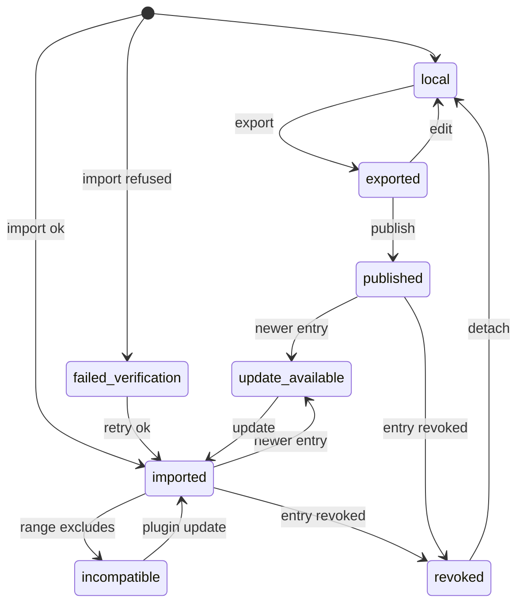

# Apps distribution lifecycle

Where an app stands between "lives only in this folder" and "installed from a marketplace", carried in `publish.state` of `module.json` (ADR-039). The local lifecycle (draft · ready · archived) stays in `status` and is untouched by any of this (codex 2026-09-11 P2).

| Field | Value |
|---|---|
| **status** | ACTIVE — program step 25 |
| **updated** | 2026-09-11 |
| Field of record | `publish.state` (absent = `local`) |
| Schema | `schemas/app-manifest.schema.json` |

## States

| State | Meaning | Entered by | Leaves to |
|---|---|---|---|
| local | the app exists only in this folder; `publish` absent or null | creation (chat, Shadow, disk, form-less New) | exported |
| exported | a tarball + checksum were produced from this folder | export (flag `apps_publish` on) | published · local (re-edit clears `exported`) |
| imported | this folder was unpacked from a verified tarball; `origin.created_by = marketplace` | import after sha256 + manifest validation | update_available · incompatible · revoked |
| published | this folder is the source of an entry in a registry | publish (later program; Publish button) | update_available (a newer entry exists) · revoked |
| update_available | the registry has a newer `published_at` with a compatible `sutra_version_range` | registry refresh | imported (after update) · incompatible |
| incompatible | the registry entry's `sutra_version_range` excludes this plugin version | registry refresh or plugin update | imported (after plugin update) · update_available |
| revoked | the registry marked the entry revoked; the app stays on disk, is shown with a warning, and never auto-updates | registry refresh | local (operator detaches it) |
| failed_verification | an import was refused (checksum, manifest, extraction contract); NOTHING landed in the folder; the state exists only as `app.imported.result` in the events log for that attempt and is NOT a `publish.state` value (the manifest enum excludes it) | import failure | imported (successful retry) |

## Diagram

Edge list (twin of the diagram): start→local, local→exported (export), exported→local (edit), exported→published (publish), start→imported (import ok), start→failed_verification (import refused), failed_verification→imported (retry ok), imported→update_available, imported→incompatible, imported→revoked, published→update_available, published→revoked, update_available→imported (update), incompatible→imported (plugin update), revoked→local (detach).

## Rules

| # | Rule |
|---|---|
| L-1 | `status: archived` is orthogonal: an archived app keeps its `publish.state` |
| L-2 | No state is entered by a read; every transition is a write that also appends an event (APPS-EVENTS.md) |
| L-3 | `failed_verification` never lands in `module.json` because nothing landed; it is reconstructed from the events log for the operator's "why did this fail" |
| L-4 | Until `flags.apps_publish` is on, the only reachable state is `local` |

---
provenance: authored 2026-09-11 (session c0a2923c, atom a-c0a2923c-11) from ADR-039, the codex program review P9 and the codex pre-consult P2/P3; program step 25.
