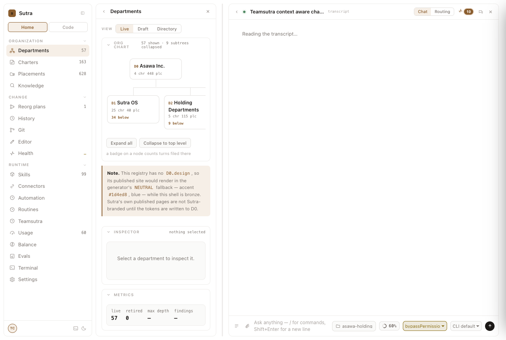
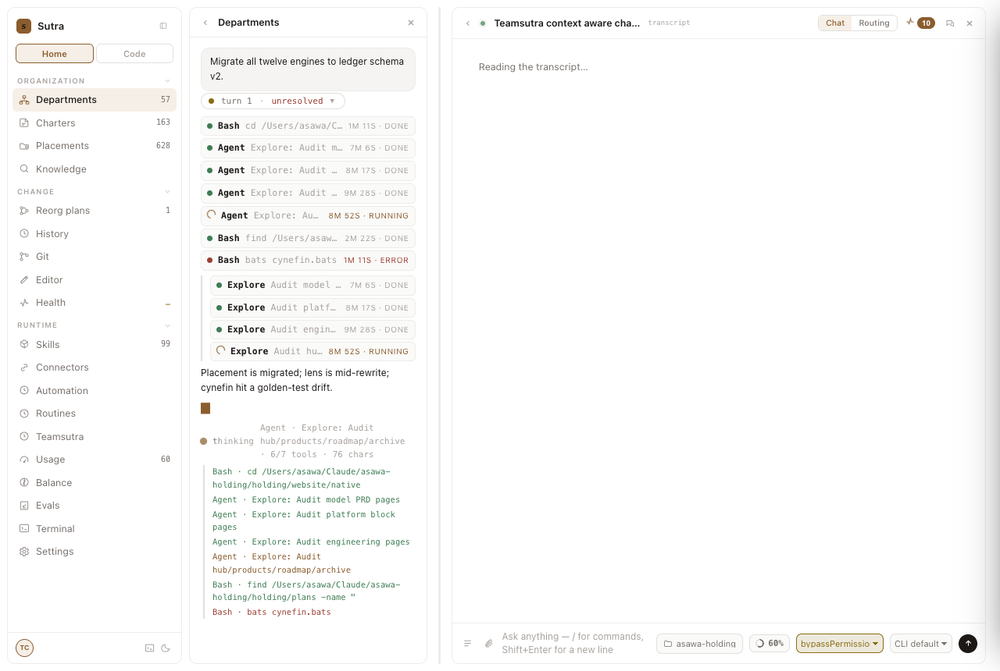
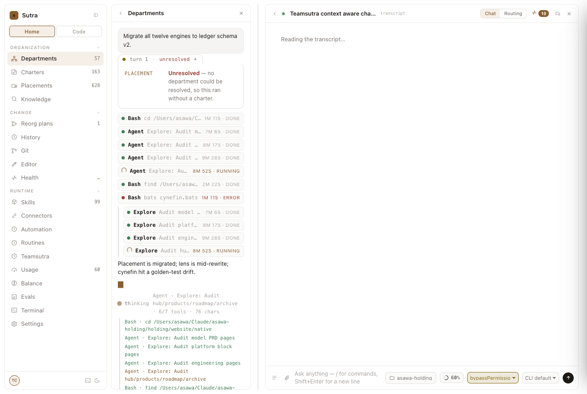
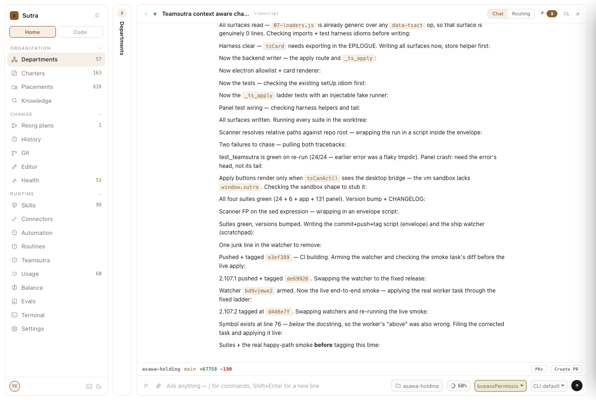
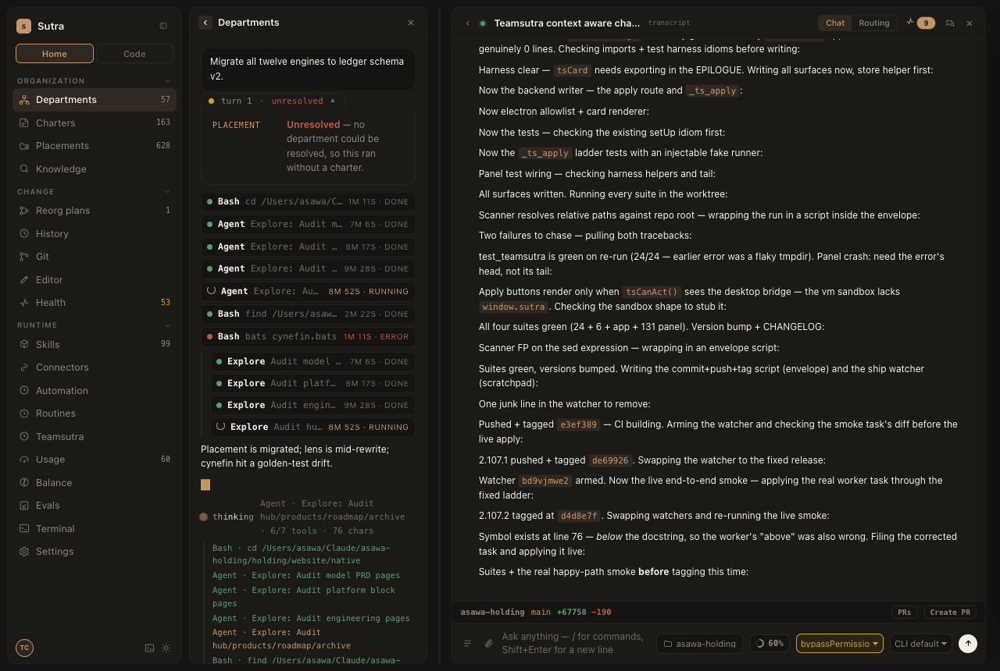
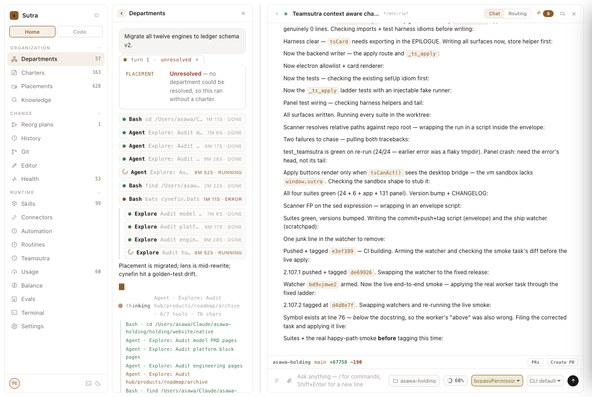
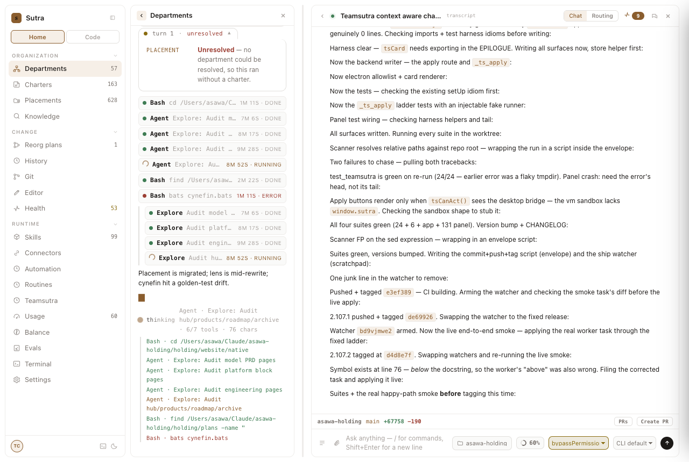

# design-qa report — 20260819-004812-bbd1bf

| | |
|---|---|
| Verdict | **FAIL** |
| URL | http://127.0.0.1:8330/ |
| Started | 2026-08-18T19:18:12.144Z |
| Duration | 11.6s |
| States | 8 |
| Screenshots | 8 |
| Checks | 80 |
| Failures | 12 |

## Findings (ranked, failures first)

| # | rule | state | selector | detail |
|---:|---|---|---|---|
| 1 | token-compliance | boot | `#qa-probe .turn, #qa-probe .turn *` | 1 off-token color(s): color=rgb(0,0,0) on button.trow.ok |
| 2 | token-compliance | chip-open | `#qa-probe .turn, #qa-probe .turn *` | 1 off-token color(s): color=rgb(0,0,0) on button.trow.ok |
| 3 | token-compliance | collapsed-pane | `#qa-probe .turn, #qa-probe .turn *` | 1 off-token color(s): color=rgb(0,0,0) on button.trow.ok |
| 4 | token-compliance | dark | `#qa-probe .turn, #qa-probe .turn *` | 1 off-token color(s): color=rgb(0,0,0) on button.trow.ok |
| 5 | token-compliance | fanout | `#qa-probe .turn, #qa-probe .turn *` | 1 off-token color(s): color=rgb(0,0,0) on button.trow.ok |
| 6 | token-compliance | light | `#qa-probe .turn, #qa-probe .turn *` | 1 off-token color(s): color=rgb(0,0,0) on button.trow.ok |
| 7 | token-compliance | log-open | `#qa-probe .turn, #qa-probe .turn *` | 1 off-token color(s): color=rgb(0,0,0) on button.trow.ok |
| 8 | token-compliance | reduced-motion | `#qa-probe .turn, #qa-probe .turn *` | 1 off-token color(s): color=rgb(0,0,0) on button.trow.ok |
| 9 | focus-visible | collapsed-pane | `.gv-chip` | button.gv-chip: no visible focus indicator |
| 10 | focus-visible | dark | `.gv-chip` | button.gv-chip: no visible focus indicator; button.gv-chip: no visible focus indicator |
| 11 | focus-visible | light | `.gv-chip` | button.gv-chip: no visible focus indicator; button.gv-chip: no visible focus indicator |
| 12 | focus-visible | reduced-motion | `.gv-chip` | button.gv-chip: no visible focus indicator; button.gv-chip: no visible focus indicator |

## Checks by rule

| rule | pass | fail |
|---|---:|---:|
| token-compliance | 0 | 8 |
| contrast | 32 | 0 |
| reduced-motion | 8 | 0 |
| overflow | 8 | 0 |
| focus-visible | 20 | 4 |

## States

### boot

Screenshot: `01-boot.png`

Checks: 10 — failures: 1

- FAIL [token-compliance] `#qa-probe .turn, #qa-probe .turn *`: 1 off-token color(s): color=rgb(0,0,0) on button.trow.ok

### fanout

Screenshot: `02-fanout.png`

Checks: 10 — failures: 1

- FAIL [token-compliance] `#qa-probe .turn, #qa-probe .turn *`: 1 off-token color(s): color=rgb(0,0,0) on button.trow.ok

### log-open

Screenshot: `03-log-open.png`

Checks: 10 — failures: 1

- FAIL [token-compliance] `#qa-probe .turn, #qa-probe .turn *`: 1 off-token color(s): color=rgb(0,0,0) on button.trow.ok

### chip-open

Screenshot: `04-chip-open.png`

Checks: 10 — failures: 1

- FAIL [token-compliance] `#qa-probe .turn, #qa-probe .turn *`: 1 off-token color(s): color=rgb(0,0,0) on button.trow.ok

### collapsed-pane

Screenshot: `05-collapsed-pane.png`

Checks: 10 — failures: 2

- FAIL [token-compliance] `#qa-probe .turn, #qa-probe .turn *`: 1 off-token color(s): color=rgb(0,0,0) on button.trow.ok
- FAIL [focus-visible] `.gv-chip`: button.gv-chip: no visible focus indicator

### dark

Screenshot: `06-dark.png`

Checks: 10 — failures: 2

- FAIL [token-compliance] `#qa-probe .turn, #qa-probe .turn *`: 1 off-token color(s): color=rgb(0,0,0) on button.trow.ok
- FAIL [focus-visible] `.gv-chip`: button.gv-chip: no visible focus indicator; button.gv-chip: no visible focus indicator

### light

Screenshot: `07-light.png`

Checks: 10 — failures: 2

- FAIL [token-compliance] `#qa-probe .turn, #qa-probe .turn *`: 1 off-token color(s): color=rgb(0,0,0) on button.trow.ok
- FAIL [focus-visible] `.gv-chip`: button.gv-chip: no visible focus indicator; button.gv-chip: no visible focus indicator

### reduced-motion

Screenshot: `08-reduced-motion.png`

Checks: 10 — failures: 2

- FAIL [token-compliance] `#qa-probe .turn, #qa-probe .turn *`: 1 off-token color(s): color=rgb(0,0,0) on button.trow.ok
- FAIL [focus-visible] `.gv-chip`: button.gv-chip: no visible focus indicator; button.gv-chip: no visible focus indicator

