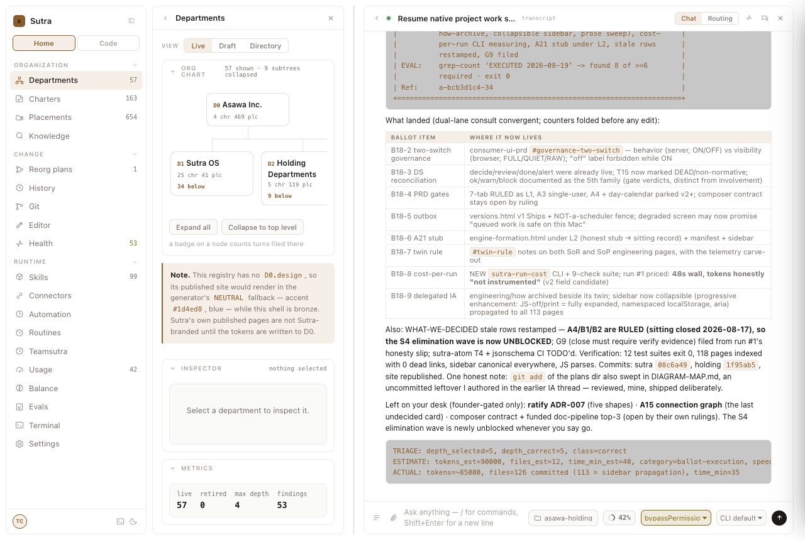
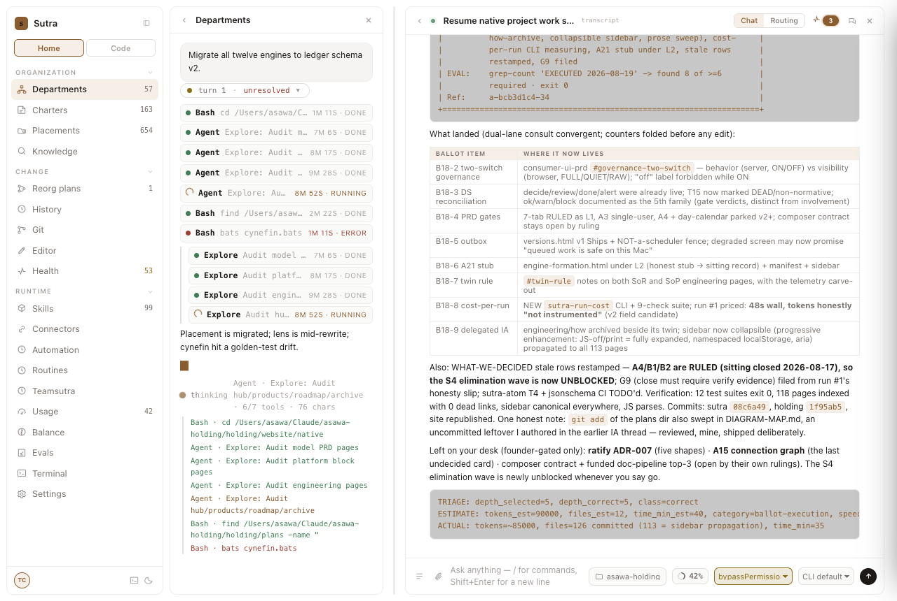
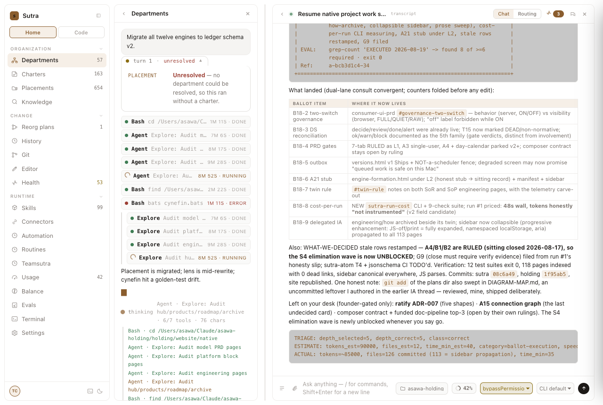
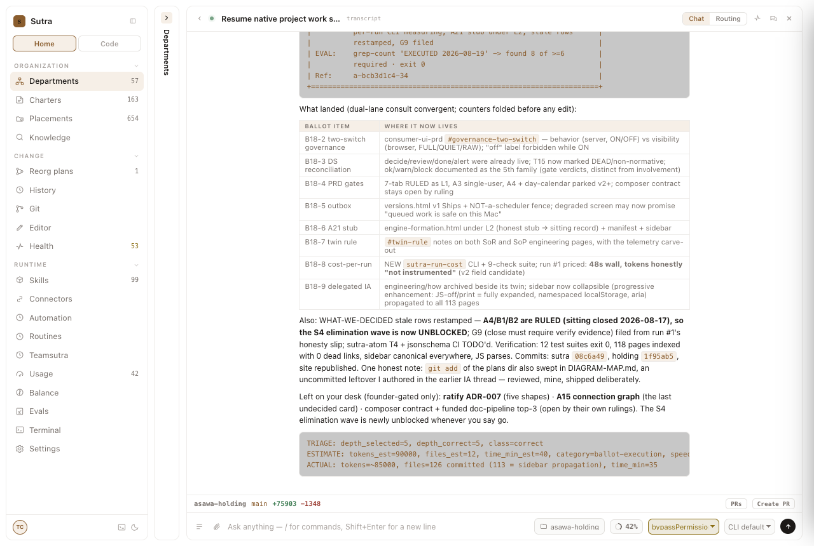
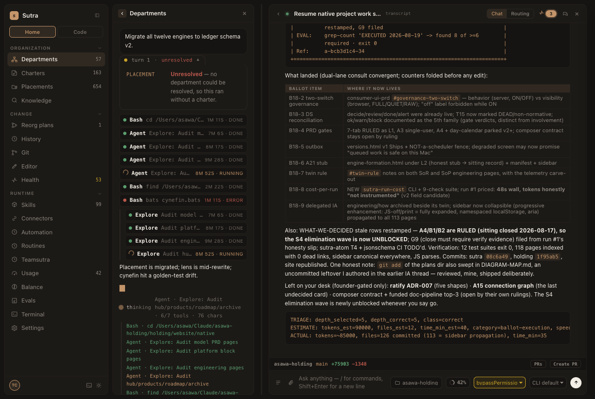
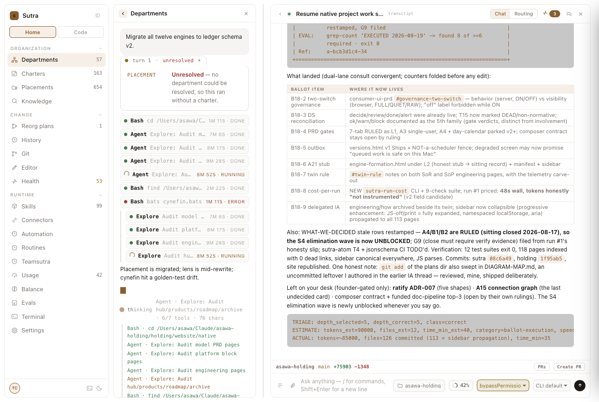
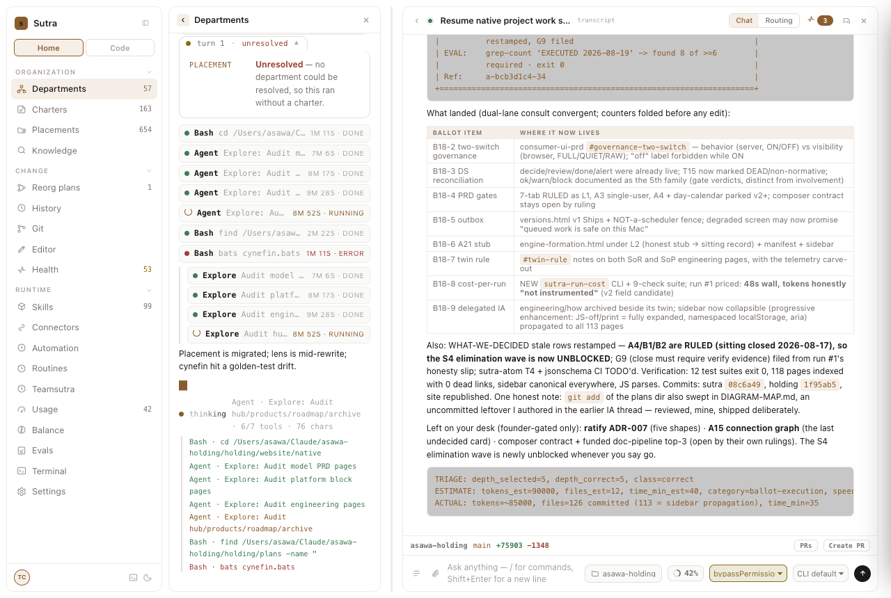

# design-qa report — 20260819-193109-960c0b

| | |
|---|---|
| Verdict | **FAIL** |
| URL | http://127.0.0.1:8330/ |
| Started | 2026-08-19T14:01:08.823Z |
| Duration | 7.2s |
| States | 8 |
| Screenshots | 8 |
| Checks | 80 |
| Failures | 20 |

## Findings (ranked, failures first)

| # | rule | state | selector | detail |
|---:|---|---|---|---|
| 1 | token-compliance | boot | `#qa-probe .turn, #qa-probe .turn *` | 1 off-token color(s): color=rgb(0,0,0) on button.trow.ok |
| 2 | token-compliance | chip-open | `#qa-probe .turn, #qa-probe .turn *` | 1 off-token color(s): color=rgb(0,0,0) on button.trow.ok |
| 3 | token-compliance | collapsed-pane | `#qa-probe .turn, #qa-probe .turn *` | 1 off-token color(s): color=rgb(0,0,0) on button.trow.ok |
| 4 | token-compliance | dark | `#qa-probe .turn, #qa-probe .turn *` | 1 off-token color(s): color=rgb(0,0,0) on button.trow.ok |
| 5 | token-compliance | fanout | `#qa-probe .turn, #qa-probe .turn *` | 1 off-token color(s): color=rgb(0,0,0) on button.trow.ok |
| 6 | token-compliance | light | `#qa-probe .turn, #qa-probe .turn *` | 1 off-token color(s): color=rgb(0,0,0) on button.trow.ok |
| 7 | token-compliance | log-open | `#qa-probe .turn, #qa-probe .turn *` | 1 off-token color(s): color=rgb(0,0,0) on button.trow.ok |
| 8 | token-compliance | reduced-motion | `#qa-probe .turn, #qa-probe .turn *` | 1 off-token color(s): color=rgb(0,0,0) on button.trow.ok |
| 9 | reduced-motion | boot | `*` | 1 element(s) still animate under prefers-reduced-motion: reduce (scanned all 8584 matching elements incl. ::before/::after): span#act-ddot (act-pulse2, 1.8s) |
| 10 | reduced-motion | chip-open | `*` | 2 element(s) still animate under prefers-reduced-motion: reduce (scanned all 8575 matching elements incl. ::before/::after): span.act-badge (act-pulse, 1.8s); span#act-ddot (act-pulse2, 1.8s) |
| 11 | reduced-motion | collapsed-pane | `*` | 1 element(s) still animate under prefers-reduced-motion: reduce (scanned all 8589 matching elements incl. ::before/::after): span#act-ddot (act-pulse2, 1.8s) |
| 12 | reduced-motion | dark | `*` | 2 element(s) still animate under prefers-reduced-motion: reduce (scanned all 8581 matching elements incl. ::before/::after): span.act-badge (act-pulse, 1.8s); span#act-ddot (act-pulse2, 1.8s) |
| 13 | reduced-motion | fanout | `*` | 2 element(s) still animate under prefers-reduced-motion: reduce (scanned all 8570 matching elements incl. ::before/::after): span.act-badge (act-pulse, 1.8s); span#act-ddot (act-pulse2, 1.8s) |
| 14 | reduced-motion | light | `*` | 2 element(s) still animate under prefers-reduced-motion: reduce (scanned all 8581 matching elements incl. ::before/::after): span.act-badge (act-pulse, 1.8s); span#act-ddot (act-pulse2, 1.8s) |
| 15 | reduced-motion | log-open | `*` | 2 element(s) still animate under prefers-reduced-motion: reduce (scanned all 8570 matching elements incl. ::before/::after): span.act-badge (act-pulse, 1.8s); span#act-ddot (act-pulse2, 1.8s) |
| 16 | reduced-motion | reduced-motion | `*` | 2 element(s) still animate under prefers-reduced-motion: reduce (scanned all 8581 matching elements incl. ::before/::after): span.act-badge (act-pulse, 1.8s); span#act-ddot (act-pulse2, 1.8s) |
| 17 | focus-visible | collapsed-pane | `.gv-chip` | button.gv-chip: no visible focus indicator |
| 18 | focus-visible | dark | `.gv-chip` | button.gv-chip: no visible focus indicator; button.gv-chip: no visible focus indicator |
| 19 | focus-visible | light | `.gv-chip` | button.gv-chip: no visible focus indicator; button.gv-chip: no visible focus indicator |
| 20 | focus-visible | reduced-motion | `.gv-chip` | button.gv-chip: no visible focus indicator; button.gv-chip: no visible focus indicator |

## Checks by rule

| rule | pass | of which vacuous | fail |
|---|---:|---:|---:|
| token-compliance | 0 | 0 | 8 |
| contrast | 32 | 0 | 0 |
| reduced-motion | 0 | 0 | 8 |
| overflow | 8 | 0 | 0 |
| focus-visible | 20 | 0 | 4 |

## States

### boot

Screenshot: `01-boot.png`

Checks: 10 — failures: 2

- FAIL [token-compliance] `#qa-probe .turn, #qa-probe .turn *`: 1 off-token color(s): color=rgb(0,0,0) on button.trow.ok
- FAIL [reduced-motion] `*`: 1 element(s) still animate under prefers-reduced-motion: reduce (scanned all 8584 matching elements incl. ::before/::after): span#act-ddot (act-pulse2, 1.8s)

### fanout

Screenshot: `02-fanout.png`

Checks: 10 — failures: 2

- FAIL [token-compliance] `#qa-probe .turn, #qa-probe .turn *`: 1 off-token color(s): color=rgb(0,0,0) on button.trow.ok
- FAIL [reduced-motion] `*`: 2 element(s) still animate under prefers-reduced-motion: reduce (scanned all 8570 matching elements incl. ::before/::after): span.act-badge (act-pulse, 1.8s); span#act-ddot (act-pulse2, 1.8s)

### log-open

Screenshot: `03-log-open.png`

Checks: 10 — failures: 2

- FAIL [token-compliance] `#qa-probe .turn, #qa-probe .turn *`: 1 off-token color(s): color=rgb(0,0,0) on button.trow.ok
- FAIL [reduced-motion] `*`: 2 element(s) still animate under prefers-reduced-motion: reduce (scanned all 8570 matching elements incl. ::before/::after): span.act-badge (act-pulse, 1.8s); span#act-ddot (act-pulse2, 1.8s)

### chip-open

Screenshot: `04-chip-open.png`

Checks: 10 — failures: 2

- FAIL [token-compliance] `#qa-probe .turn, #qa-probe .turn *`: 1 off-token color(s): color=rgb(0,0,0) on button.trow.ok
- FAIL [reduced-motion] `*`: 2 element(s) still animate under prefers-reduced-motion: reduce (scanned all 8575 matching elements incl. ::before/::after): span.act-badge (act-pulse, 1.8s); span#act-ddot (act-pulse2, 1.8s)

### collapsed-pane

Screenshot: `05-collapsed-pane.png`

Checks: 10 — failures: 3

- FAIL [token-compliance] `#qa-probe .turn, #qa-probe .turn *`: 1 off-token color(s): color=rgb(0,0,0) on button.trow.ok
- FAIL [reduced-motion] `*`: 1 element(s) still animate under prefers-reduced-motion: reduce (scanned all 8589 matching elements incl. ::before/::after): span#act-ddot (act-pulse2, 1.8s)
- FAIL [focus-visible] `.gv-chip`: button.gv-chip: no visible focus indicator

### dark

Screenshot: `06-dark.png`

Checks: 10 — failures: 3

- FAIL [token-compliance] `#qa-probe .turn, #qa-probe .turn *`: 1 off-token color(s): color=rgb(0,0,0) on button.trow.ok
- FAIL [reduced-motion] `*`: 2 element(s) still animate under prefers-reduced-motion: reduce (scanned all 8581 matching elements incl. ::before/::after): span.act-badge (act-pulse, 1.8s); span#act-ddot (act-pulse2, 1.8s)
- FAIL [focus-visible] `.gv-chip`: button.gv-chip: no visible focus indicator; button.gv-chip: no visible focus indicator

### light

Screenshot: `07-light.png`

Checks: 10 — failures: 3

- FAIL [token-compliance] `#qa-probe .turn, #qa-probe .turn *`: 1 off-token color(s): color=rgb(0,0,0) on button.trow.ok
- FAIL [reduced-motion] `*`: 2 element(s) still animate under prefers-reduced-motion: reduce (scanned all 8581 matching elements incl. ::before/::after): span.act-badge (act-pulse, 1.8s); span#act-ddot (act-pulse2, 1.8s)
- FAIL [focus-visible] `.gv-chip`: button.gv-chip: no visible focus indicator; button.gv-chip: no visible focus indicator

### reduced-motion

Screenshot: `08-reduced-motion.png`

Checks: 10 — failures: 3

- FAIL [token-compliance] `#qa-probe .turn, #qa-probe .turn *`: 1 off-token color(s): color=rgb(0,0,0) on button.trow.ok
- FAIL [reduced-motion] `*`: 2 element(s) still animate under prefers-reduced-motion: reduce (scanned all 8581 matching elements incl. ::before/::after): span.act-badge (act-pulse, 1.8s); span#act-ddot (act-pulse2, 1.8s)
- FAIL [focus-visible] `.gv-chip`: button.gv-chip: no visible focus indicator; button.gv-chip: no visible focus indicator

