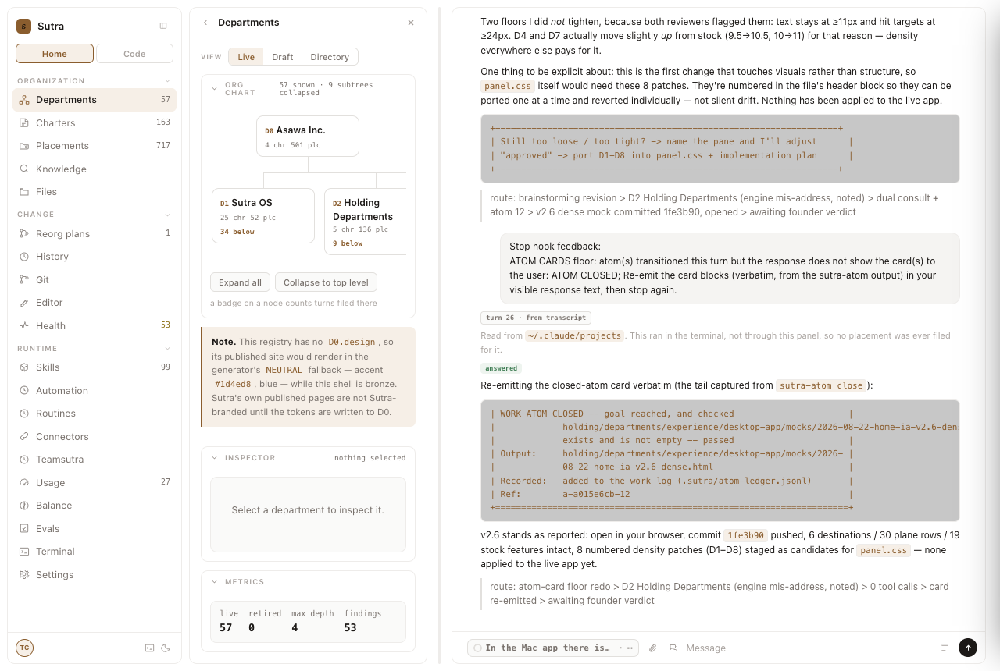
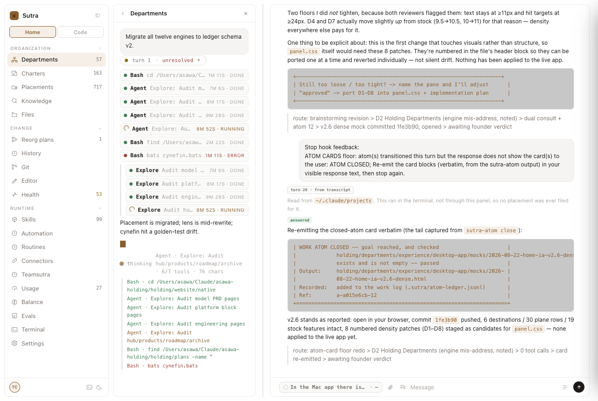
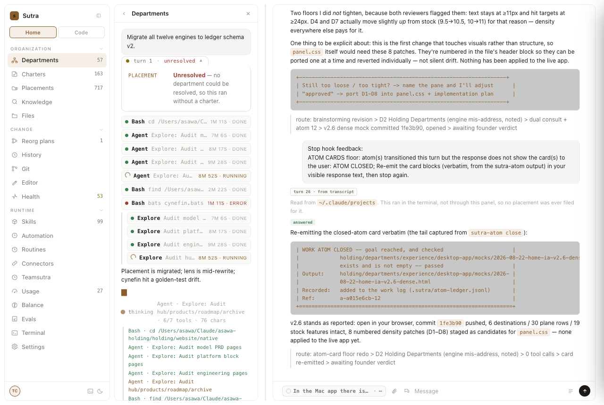
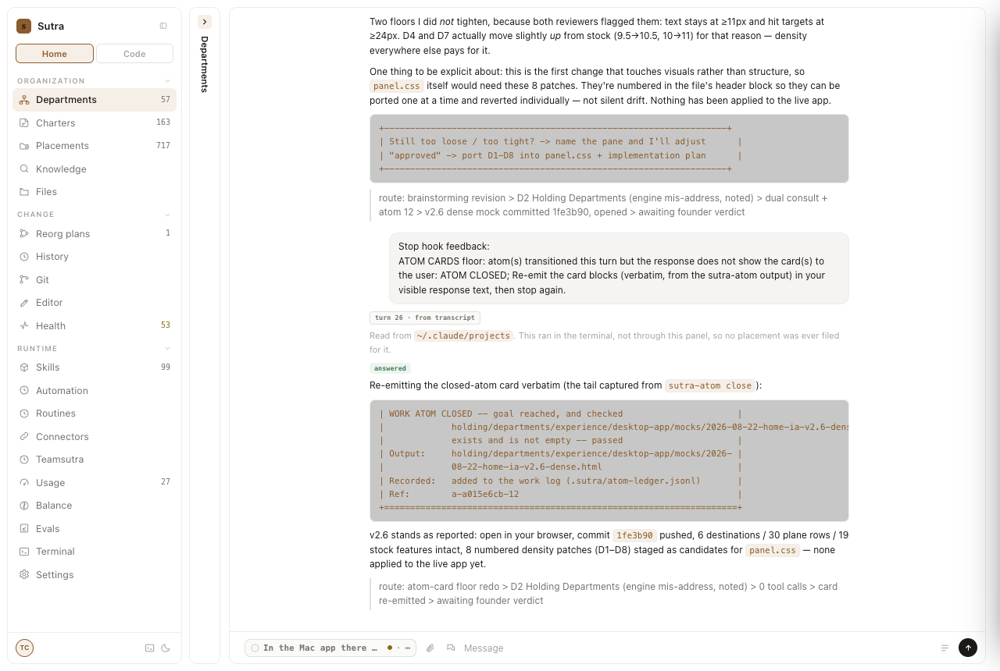
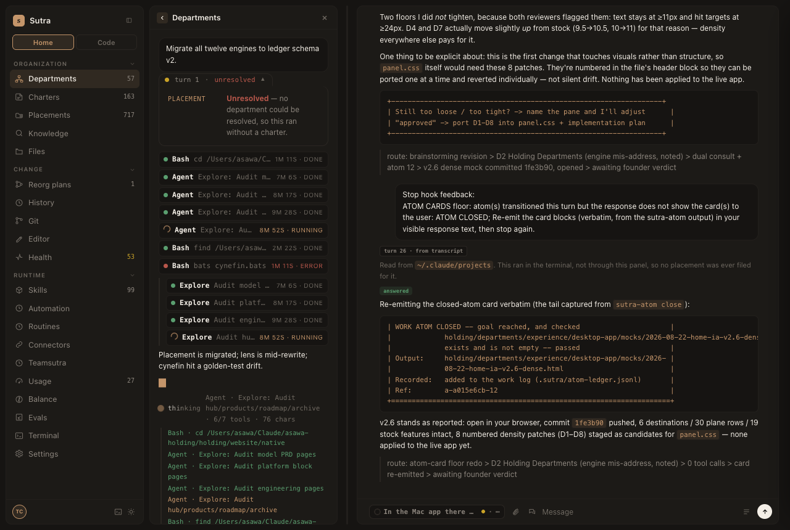
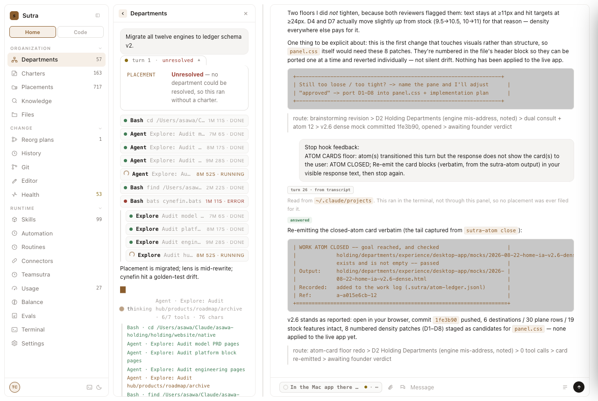
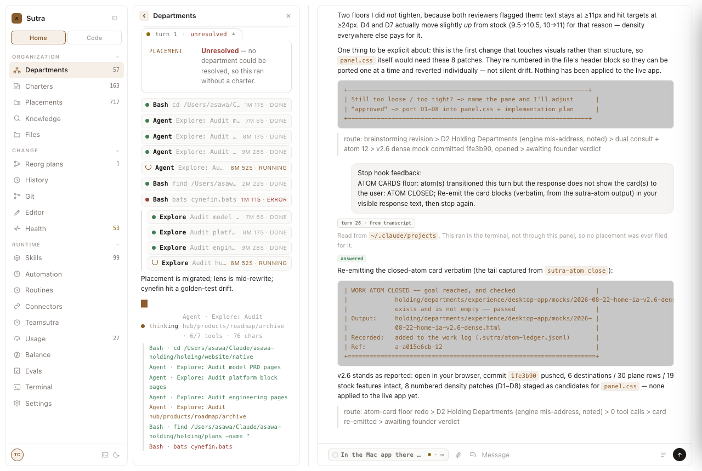

# design-qa report — 20260822-160652-3803d0

| | |
|---|---|
| Verdict | **PASS** |
| URL | http://127.0.0.1:7011/ |
| Started | 2026-08-22T10:36:52.072Z |
| Duration | 8.6s |
| States | 8 |
| Screenshots | 8 |
| Checks | 80 |
| Failures | 0 |

## Findings (ranked, failures first)

No failures. All checks passed.

## Checks by rule

| rule | pass | of which vacuous | fail |
|---|---:|---:|---:|
| token-compliance | 8 | 0 | 0 |
| contrast | 32 | 0 | 0 |
| reduced-motion | 8 | 0 | 0 |
| overflow | 8 | 0 | 0 |
| focus-visible | 24 | 0 | 0 |

## States

### boot

Screenshot: `01-boot.png`

Checks: 10 — failures: 0

### fanout

Screenshot: `02-fanout.png`

Checks: 10 — failures: 0

### log-open

Screenshot: `03-log-open.png`

Checks: 10 — failures: 0

### chip-open

Screenshot: `04-chip-open.png`

Checks: 10 — failures: 0

### collapsed-pane

Screenshot: `05-collapsed-pane.png`

Checks: 10 — failures: 0

### dark

Screenshot: `06-dark.png`

Checks: 10 — failures: 0

### light

Screenshot: `07-light.png`

Checks: 10 — failures: 0

### reduced-motion

Screenshot: `08-reduced-motion.png`

Checks: 10 — failures: 0

