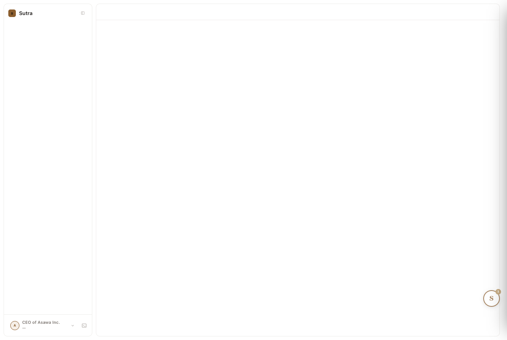

# design-qa report — 20260828-092632-ab0e13

| | |
|---|---|
| Verdict | **FAIL** |
| URL | http://127.0.0.1:8330/ |
| Started | 2026-08-28T03:56:31.575Z |
| Duration | 527.9s |
| States | 8 |
| Screenshots | 6 |
| Checks | 62 |
| Failures | 2 |

## Findings (ranked, failures first)

| # | rule | state | selector | detail |
|---:|---|---|---|---|
| 1 | state-capture | collapsed-pane | `-` | state failed before rules could run: page.click: Timeout 10000ms exceeded. Call log:   - waiting for locator('[data-pane-fold]')  |
| 2 | state-capture | dark | `-` | state failed before rules could run: page.click: Timeout 10000ms exceeded. Call log:   - waiting for locator('[data-pane-fold]')  |

## Checks by rule

| rule | pass | of which vacuous | fail |
|---|---:|---:|---:|
| token-compliance | 6 | 0 | 0 |
| contrast | 24 | 0 | 0 |
| reduced-motion | 6 | 0 | 0 |
| overflow | 6 | 0 | 0 |
| focus-visible | 18 | 0 | 0 |
| state-capture | 0 | 0 | 2 |

## States

### boot

Screenshot: `01-boot.png`

Checks: 10 — failures: 0

### fanout

Screenshot: `02-fanout.png`

Checks: 10 — failures: 0

### log-open

Screenshot: `03-log-open.png`

Checks: 10 — failures: 0

### chip-open

Screenshot: `04-chip-open.png`

Checks: 10 — failures: 0

### collapsed-pane

Screenshot: none (state errored before capture)

Error: page.click: Timeout 10000ms exceeded. Call log:   - waiting for locator('[data-pane-fold]') 

Checks: 1 — failures: 1

- FAIL [state-capture] `-`: state failed before rules could run: page.click: Timeout 10000ms exceeded. Call log:   - waiting for locator('[data-pane-fold]') 

### dark

Screenshot: none (state errored before capture)

Error: page.click: Timeout 10000ms exceeded. Call log:   - waiting for locator('[data-pane-fold]') 

Checks: 1 — failures: 1

- FAIL [state-capture] `-`: state failed before rules could run: page.click: Timeout 10000ms exceeded. Call log:   - waiting for locator('[data-pane-fold]') 

### light

Screenshot: `07-light.png`

Checks: 10 — failures: 0

### reduced-motion

Screenshot: `08-reduced-motion.png`

Checks: 10 — failures: 0

