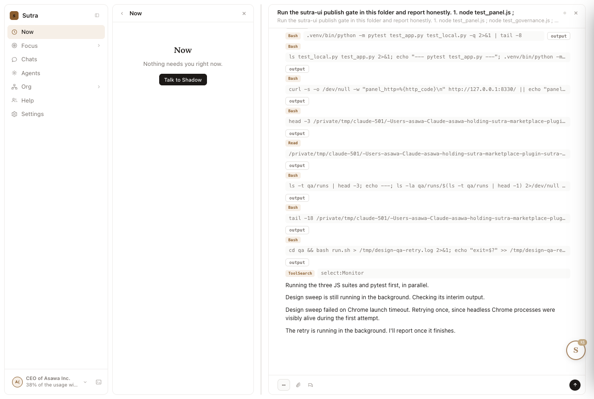
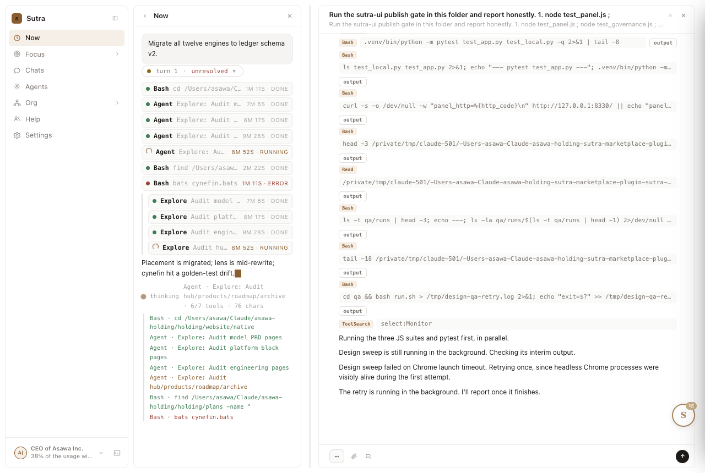

# design-qa report — 20260909-085734-dd5269

| | |
|---|---|
| Verdict | **FAIL** |
| URL | http://127.0.0.1:8330/ |
| Started | 2026-09-09T03:27:32.900Z |
| Duration | 912.4s |
| States | 8 |
| Screenshots | 3 |
| Checks | 33 |
| Failures | 8 |

## Findings (ranked, failures first)

| # | rule | state | selector | detail |
|---:|---|---|---|---|
| 1 | state-capture | chip-open | `-` | state failed before rules could run: page.evaluate: Target page, context or browser has been closed |
| 2 | state-capture | collapsed-pane | `-` | state failed before rules could run: page.click: Target page, context or browser has been closed |
| 3 | state-capture | dark | `-` | state failed before rules could run: page.click: Target page, context or browser has been closed |
| 4 | state-capture | light | `-` | state failed before rules could run: page.evaluate: Target page, context or browser has been closed |
| 5 | state-capture | reduced-motion | `-` | state failed before rules could run: page.emulateMedia: Target page, context or browser has been closed |
| 6 | overflow | log-open | `-` | rule crashed: page.evaluate: Target page, context or browser has been closed |
| 7 | reduced-motion | log-open | `-` | rule crashed: page.evaluate: Target page, context or browser has been closed Browser logs:  <launching> /Applications/Google Chrome.app/Contents/MacOS/Google Chrome --disable-field-trial-config --disable-background-networking --disable-background-timer-throttling --disable-backgrounding-occluded-windows --disable-back-forward-cache --disable-breakpad --disable-client-side-phishing-detection --disable-component-extensions-with-background-pages --disable-component-update --no-default-browser-check --disable-default-apps --disable-dev-shm-usage --disable-edgeupdater --disable-extensions --disable-features=AvoidUnnecessaryBeforeUnloadCheckSync,BoundaryEventDispatchTracksNodeRemoval,DestroyProfileOnBrowserClose,DialMediaRouteProvider,GlobalMediaControls,HttpsUpgrades,LensOverlay,MediaRouter,PaintHolding,ThirdPartyStoragePartitioning,BlockOriginHeaderModificationOnRedirect,Translate,AutoDeElevate,OptimizationHints,msForceBrowserSignIn,msEdgeUpdateLaunchServicesPreferredVersion --enable-features=CDPScreenshotNewSurface --allow-pre-commit-input --disable-hang-monitor --disable-ipc-flooding-protection --disable-popup-blocking --disable-prompt-on-repost --disable-renderer-backgrounding --disable-updater-scheduler --force-color-profile=srgb --metrics-recording-only --no-first-run --password-store=basic --use-mock-keychain --no-service-autorun --export-tagged-pdf --disable-search-engine-choice-screen --unsafely-disable-devtools-self-xss-warnings --edge-skip-compat-layer-relaunch --disable-infobars --disable-search-engine-choice-screen --disable-sync --enable-unsafe-swiftshader --headless --hide-scrollbars --mute-audio --blink-settings=primaryHoverType=2,availableHoverTypes=2,primaryPointerType=4,availablePointerTypes=4 --no-sandbox --user-data-dir=/var/folders/0d/mg6l6trs0951z844n9fc50jr0000gn/T/playwright_chromiumdev_profile-DvfghG --remote-debugging-pipe --no-startup-window <launched> pid=86755 [pid=86755][err] Trying to load the allocator multiple times. This is *not* supported. [pid=86755][err] [86766:59987935:0909/085738.483270:ERROR:ui/display/mac/cv_display_link_mac.mm:195] CVDisplayLinkCreateWithCGDisplay failed. CVReturn: -6670 [pid=86755][err] [86766:59987966:0909/085738.486302:ERROR:ui/display/mac/cv_display_link_mac.mm:195] CVDisplayLinkCreateWithCGDisplay failed. CVReturn: -6670 [pid=86755][err] [86766:59987935:0909/085738.493492:ERROR:ui/display/mac/cv_display_link_mac.mm:195] CVDisplayLinkCreateWithCGDisplay failed. CVReturn: -6670 [pid=86755][err] [86766:59987966:0909/085738.493555:ERROR:ui/display/mac/cv_display_link_mac.mm:195] CVDisplayLinkCreateWithCGDisplay failed. CVReturn: -6670 [pid=86755][err] [86766:59987935:0909/085738.493695:ERROR:ui/display/mac/cv_display_link_mac.mm:195] CVDisplayLinkCreateWithCGDisplay failed. CVReturn: -6670 [pid=86755][err] [86766:59987966:0909/085738.493761:ERROR:ui/display/mac/cv_display_link_mac.mm:195] CVDisplayLinkCreateWithCGDisplay failed. CVReturn: -6670 [pid=86755][err] [86766:59987935:0909/085738.493879:ERROR:ui/display/mac/cv_display_link_mac.mm:195] CVDisplayLinkCreateWithCGDisplay failed. CVReturn: -6670 [pid=86755][err] [86766:59987966:0909/085738.493956:ERROR:ui/display/mac/cv_display_link_mac.mm:195] CVDisplayLinkCreateWithCGDisplay failed. CVReturn: -6670 [pid=86755][err] [86766:59987935:0909/085738.494062:ERROR:ui/display/mac/cv_display_link_mac.mm:195] CVDisplayLinkCreateWithCGDisplay failed. CVReturn: -6670 [pid=86755][err] [86766:59987966:0909/085738.494114:ERROR:ui/display/mac/cv_display_link_mac.mm:195] CVDisplayLinkCreateWithCGDisplay failed. CVReturn: -6670 [pid=86755] <gracefully close start> [pid=86755] <forcefully close> [pid=86755] <kill> [pid=86755] <will force kill> |
| 8 | focus-visible | log-open | `-` | rule crashed: page.evaluate: Target page, context or browser has been closed |

## Checks by rule

| rule | pass | of which vacuous | fail |
|---|---:|---:|---:|
| token-compliance | 3 | 0 | 0 |
| contrast | 12 | 0 | 0 |
| reduced-motion | 2 | 0 | 1 |
| overflow | 2 | 0 | 1 |
| focus-visible | 6 | 0 | 1 |
| state-capture | 0 | 0 | 5 |

## States

### boot

Screenshot: `01-boot.png`

Checks: 10 — failures: 0

### fanout

Screenshot: `02-fanout.png`

Checks: 10 — failures: 0

### log-open

Screenshot: `03-log-open.png`

Checks: 8 — failures: 3

- FAIL [reduced-motion] `-`: rule crashed: page.evaluate: Target page, context or browser has been closed Browser logs:  <launching> /Applications/Google Chrome.app/Contents/MacOS/Google Chrome --disable-field-trial-config --disable-background-networking --disable-background-timer-throttling --disable-backgrounding-occluded-windows --disable-back-forward-cache --disable-breakpad --disable-client-side-phishing-detection --disable-component-extensions-with-background-pages --disable-component-update --no-default-browser-check --disable-default-apps --disable-dev-shm-usage --disable-edgeupdater --disable-extensions --disable-features=AvoidUnnecessaryBeforeUnloadCheckSync,BoundaryEventDispatchTracksNodeRemoval,DestroyProfileOnBrowserClose,DialMediaRouteProvider,GlobalMediaControls,HttpsUpgrades,LensOverlay,MediaRouter,PaintHolding,ThirdPartyStoragePartitioning,BlockOriginHeaderModificationOnRedirect,Translate,AutoDeElevate,OptimizationHints,msForceBrowserSignIn,msEdgeUpdateLaunchServicesPreferredVersion --enable-features=CDPScreenshotNewSurface --allow-pre-commit-input --disable-hang-monitor --disable-ipc-flooding-protection --disable-popup-blocking --disable-prompt-on-repost --disable-renderer-backgrounding --disable-updater-scheduler --force-color-profile=srgb --metrics-recording-only --no-first-run --password-store=basic --use-mock-keychain --no-service-autorun --export-tagged-pdf --disable-search-engine-choice-screen --unsafely-disable-devtools-self-xss-warnings --edge-skip-compat-layer-relaunch --disable-infobars --disable-search-engine-choice-screen --disable-sync --enable-unsafe-swiftshader --headless --hide-scrollbars --mute-audio --blink-settings=primaryHoverType=2,availableHoverTypes=2,primaryPointerType=4,availablePointerTypes=4 --no-sandbox --user-data-dir=/var/folders/0d/mg6l6trs0951z844n9fc50jr0000gn/T/playwright_chromiumdev_profile-DvfghG --remote-debugging-pipe --no-startup-window <launched> pid=86755 [pid=86755][err] Trying to load the allocator multiple times. This is *not* supported. [pid=86755][err] [86766:59987935:0909/085738.483270:ERROR:ui/display/mac/cv_display_link_mac.mm:195] CVDisplayLinkCreateWithCGDisplay failed. CVReturn: -6670 [pid=86755][err] [86766:59987966:0909/085738.486302:ERROR:ui/display/mac/cv_display_link_mac.mm:195] CVDisplayLinkCreateWithCGDisplay failed. CVReturn: -6670 [pid=86755][err] [86766:59987935:0909/085738.493492:ERROR:ui/display/mac/cv_display_link_mac.mm:195] CVDisplayLinkCreateWithCGDisplay failed. CVReturn: -6670 [pid=86755][err] [86766:59987966:0909/085738.493555:ERROR:ui/display/mac/cv_display_link_mac.mm:195] CVDisplayLinkCreateWithCGDisplay failed. CVReturn: -6670 [pid=86755][err] [86766:59987935:0909/085738.493695:ERROR:ui/display/mac/cv_display_link_mac.mm:195] CVDisplayLinkCreateWithCGDisplay failed. CVReturn: -6670 [pid=86755][err] [86766:59987966:0909/085738.493761:ERROR:ui/display/mac/cv_display_link_mac.mm:195] CVDisplayLinkCreateWithCGDisplay failed. CVReturn: -6670 [pid=86755][err] [86766:59987935:0909/085738.493879:ERROR:ui/display/mac/cv_display_link_mac.mm:195] CVDisplayLinkCreateWithCGDisplay failed. CVReturn: -6670 [pid=86755][err] [86766:59987966:0909/085738.493956:ERROR:ui/display/mac/cv_display_link_mac.mm:195] CVDisplayLinkCreateWithCGDisplay failed. CVReturn: -6670 [pid=86755][err] [86766:59987935:0909/085738.494062:ERROR:ui/display/mac/cv_display_link_mac.mm:195] CVDisplayLinkCreateWithCGDisplay failed. CVReturn: -6670 [pid=86755][err] [86766:59987966:0909/085738.494114:ERROR:ui/display/mac/cv_display_link_mac.mm:195] CVDisplayLinkCreateWithCGDisplay failed. CVReturn: -6670 [pid=86755] <gracefully close start> [pid=86755] <forcefully close> [pid=86755] <kill> [pid=86755] <will force kill>
- FAIL [overflow] `-`: rule crashed: page.evaluate: Target page, context or browser has been closed
- FAIL [focus-visible] `-`: rule crashed: page.evaluate: Target page, context or browser has been closed

### chip-open

Screenshot: none (state errored before capture)

Error: page.evaluate: Target page, context or browser has been closed

Checks: 1 — failures: 1

- FAIL [state-capture] `-`: state failed before rules could run: page.evaluate: Target page, context or browser has been closed

### collapsed-pane

Screenshot: none (state errored before capture)

Error: page.click: Target page, context or browser has been closed

Checks: 1 — failures: 1

- FAIL [state-capture] `-`: state failed before rules could run: page.click: Target page, context or browser has been closed

### dark

Screenshot: none (state errored before capture)

Error: page.click: Target page, context or browser has been closed

Checks: 1 — failures: 1

- FAIL [state-capture] `-`: state failed before rules could run: page.click: Target page, context or browser has been closed

### light

Screenshot: none (state errored before capture)

Error: page.evaluate: Target page, context or browser has been closed

Checks: 1 — failures: 1

- FAIL [state-capture] `-`: state failed before rules could run: page.evaluate: Target page, context or browser has been closed

### reduced-motion

Screenshot: none (state errored before capture)

Error: page.emulateMedia: Target page, context or browser has been closed

Checks: 1 — failures: 1

- FAIL [state-capture] `-`: state failed before rules could run: page.emulateMedia: Target page, context or browser has been closed

